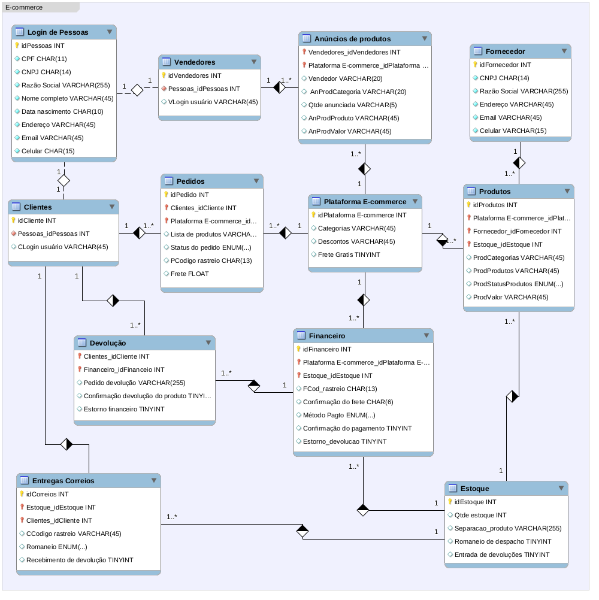

### **<u>Projeto de Banco de Dados para um E-commerce</u>**

Modelamos um contexto reduzido de e-commerce como um desafio do bootcamp Database Experience da [Digital Innovation One (DiO)](https://web.dio.me/track/database-experience) , utilizando a ferramenta MySQL Workbench e os conceitos de primary key e foreign key, criando um esquema conceitual para o cenário proposto de e-commerce.

Num segundo momento realizamos a modelagem do projeto lógico baseado no esquema conceitual. Criamos o Script SQL, persistimos dados para realização de testes, criamos queries SQL com as cláusulas SELECT, WHERE, JOIN, ORDER BY e HAVING para recuperar dados suficientes para obter informações complexas, que nos ajudará a entender melhor o cenário de e-commerce para tomada de decisões. 

#### Narrativa do contexto / cenário

O escopo é a venda de produtos online envolvendo fornecedor, produtos, estoque, pedidos e clientes;

- Produtos / fornecedor
  - Os produtos são vendidos por uma única plataforma online;
  - Cada produto possui um fornecedor;
  - Um ou mais produtos compõem um pedido.
- Clientes
  - O cliente pode se cadastrar no site como pessoa física (CPF) ou pessoa jurídica (CNPJ), mas não pode ter as duas informações;
  - O endereço do cliente irá determinar o valor do frete;
  - Um cliente pode comprar mais de um pedido;
  - O pedido tem um período de carência para devolução do produto.
- Pedidos
  - Os pedidos são criados por clientes e possuem informações de compra, endereço e status da entrega;
  - Um ou mais produtos compõem o pedido;
  - O pedido pode ser cancelado.

- Pagamentos
  - Pode ser cadastrado mais de uma forma de pagamento.
- Entregas
  - Possui status e código de rastreio.
- Queries
  - Não há um mínimo de queries a serem realizadas;
  - Os tópicos supracitados devem estar presentes nas queries;
  - Elabore perguntas que podem ser respondidas pelas consultas;
  - As cláusulas podem estar presentes em mais de uma query.

#### Modelagem Esquema Conceitual

Adicionamos entidades e atributos típicos do contexto de e-commerce, para que a modelagem represente da melhor forma possível o mundo real. Inserimos a possibilidade de vendedores como usuários da plataforma, a existência de um sistema financeiro de pagamento integrado com o estoque e uma transportadora para realizar as entregas e encaminhar devoluções.

#### Projeto Lógico

Consta anexo neste repositório o arquivo do MySQL Workbench com o projeto lógico, com o Script SQL, os dados persistimos e as queries SQL.

##### Ferramentas utilizadas:

- Linguagem SQL
- MySQL Workbench (versão linux/ubuntu)
- Typora
- Git / Github